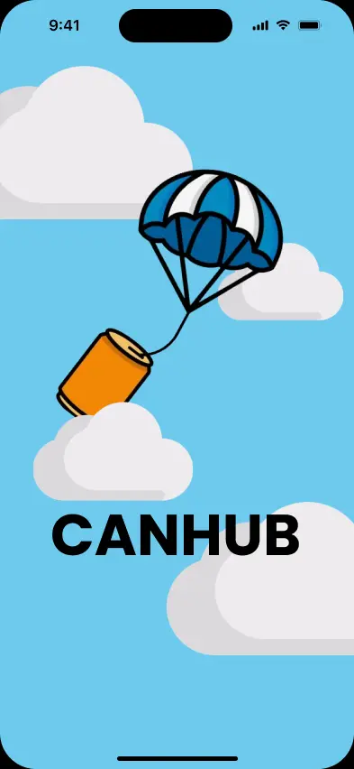
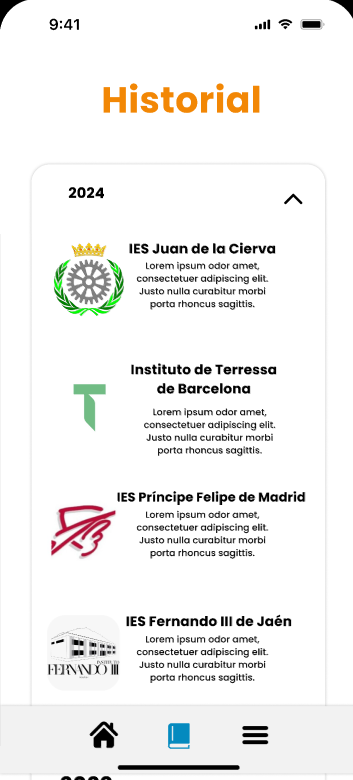
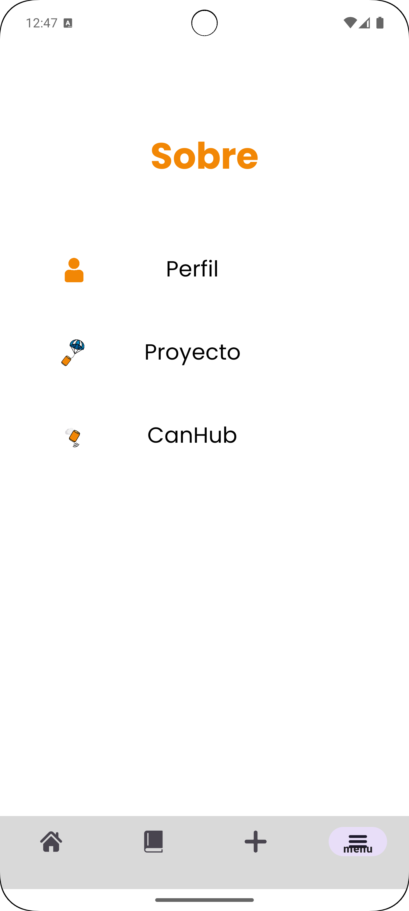

# CANHUB

## Significado de la aplicación-->

*CanHub* hace referencia al intercambio de información que se da en el concurso Cansat, a nivel estatal.

Es la unión de las palabras: _Cansat_ y _Hub_.

El logo de la aplicación es una lata sujeta de un paracaídas, pues es el propósito del concurso:

## Descripción -->

El fin de esta aplicación es poder almacenar los proyectos que el usuario suba y
que sirva de fuente de recursos para el futuro.

## Activities -->

### Splash:

Simulamos el evento, la lata volando por el cielo:

### Login:
Este sería el login de la aplicación, se pedirá el nombre de usuario
y contraseña, en caso de ser nuevo usuario, existe la opción de registrarse o continuar sin cuenta.

### SignUp:
En SignUp, será obligatorio un nombre de usuario, un correo y una contraseña
para crear la cuenta. 

En caso de tener cuenta ya, se podrá iniciar sesión o en caso de
no querer registrarse ni iniciar sesión, se puede continuar sin cuenta.

### Main:
Dentro del main, observamos el nombre, logo y descripción de los diferentes
institutos, están ordenados por más reciente.

### Búsqueda:
En la sección de busqueda, se encontrará ordenado por años los institutos 
que han participado en los diferentes año.
 

### Ajustes:
En ajustes, encontramos la opción del perfil, el proyecto y sobre CanHub

### Perfil

## FIGMA
https://www.figma.com/design/OunNjvK0FjgY8fAPnY2CSC/CanHub?node-id=3-2&t=f19XVQm3dMlhhGoA-1
